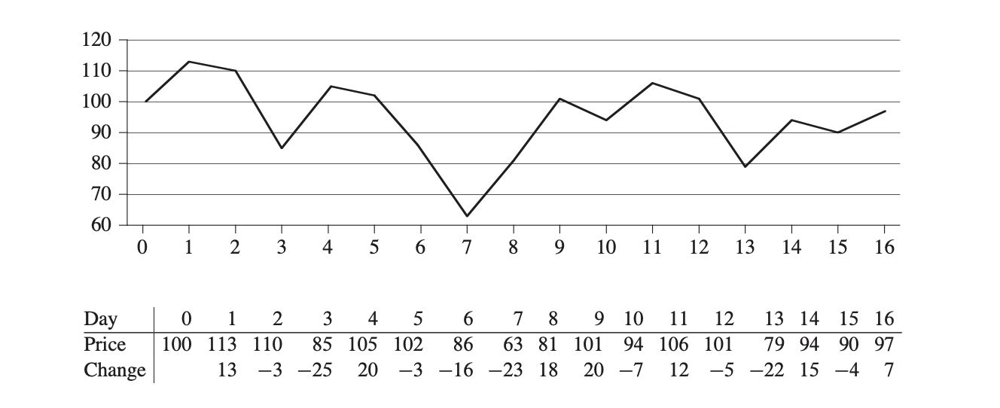
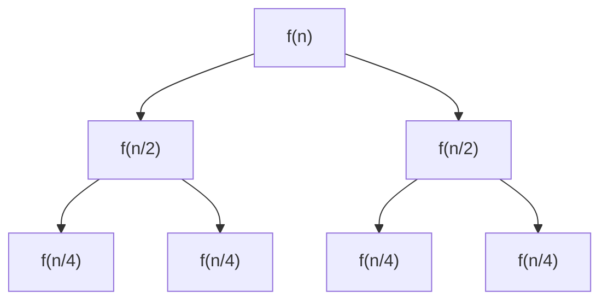
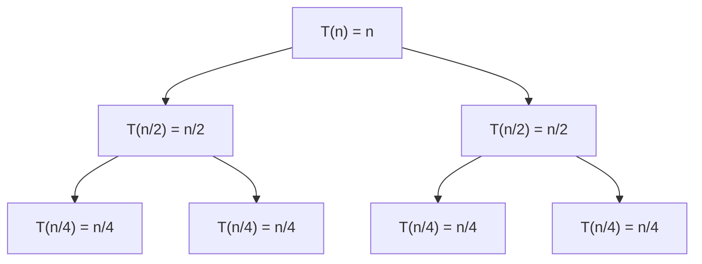

# Chap 4 Divide and Conquer(分冶法)

本章通过两个例子来介绍分冶法（自己调用自己的方法，很有意思），一个是最大子数组问题，另一个是矩阵乘法。

## 1. 分冶法的步骤：

根据分冶法的名字，可以用一个中国古典成语来理解-分而治之，也就是：当你要解决一个费时，但是又没有什么新方法加快的问题时，你可以先将这个问题分成很多个更小规模的子问题，然后再逐个解决，这时候你所消耗的资源多了（人力等），但是解决问题的时间减少了。

分冶法的步骤是：

1. Divide(分解)：将大问题分解成若干个子问题
2. Conquer(解决)：将子问题逐个解决
3. Combine(合并)：将每个子问题所得到的结果合并为大问题的答案。

比如，有10块硬币，我们需要找出其中一枚劣质硬币(更轻)，如果只通过一杆秤，我们最多需要9次才能找出。如果我们先把10个硬币，两两进行分组，然后每一组都去比较，那么最多需要5次就可以解决问题；

再比如，你有一个班的人（30人），你需要对身高进行排序，对于分冶法来说，就需要将30个人分成2组，这两组人身高排序完之后再合并起来（但是其实可以分成15组，每一组的两个人进行身高比较，所有组排序好之后，两组两组之间进行合并）

## 2.递归式（recurrence）

对于分冶法来说，最重要的就是对于某一个问题，某一个方法的递归式，一般的形式是这样的：
$$
T(n) = aT(n/b)+T(n)
$$
其中T(n)表示当输入的规模为n时该算法的运行时间，a表示每一次需要分解成多少个相同规模的子问题，n/b表示每次子问题的规模大小。

对于上面这种形式的递归式可以很方便地使用The master Method （主方法）解决，对于其他形式的递归式，我们可以通过递归树或者替代法（intuition，guess）。


## 3. 最大子数组问题

### 1. 问题：

首先，在日常生活中会有很多人喜欢投资买股票，每一天的股价都会变化，问题是：**如果你是一个很聪明的投资者，假设你知道未来20天的股价（当然这不现实），你会选择在何时买入何时卖出，来获得最大的收益。**

上面就是我们的股价变化的曲线图，下面的表格是每一天的股价，以及第i天股价的变化C(i) = P(i)-P(i-1)(即第i天股价的变化等于当天股价减去前一天的股价)。

### 2.暴力解法：

一种暴力的解法就是，如果我有n天的股价，我可以把所有的可能性都列出来，计算每一种情况的收益，最后通过搜索得到最大收益的那种可能性。

分析：首先一共有n天买家可以买入，第i天买入的话，卖出的可能性就有n-i种，所以一共有：
$$
\sum_{i = 0}^{n-1}(n-i) = n(n-1)-\frac{n(n-1)}{2} = \frac{n(n-1)}{2}
$$
因此只要计算出所有可能性的收益，最后找出最大值(使用最普通的搜索算法):

```Python
def Find_Max_Number_Of_List(A):
    n = len(A)
    temporary_index = 0
    for i in range(n):
        if A[i]>=A[temporary_index]:
            max = A[i]
            temporary_index = i
    return A[temporary_index],temporary_index+1
Find_Max_Number_Of_List([1,2,34,4,56,6])
```

可以看到搜索算法运行次数的数量级是 $\Theta(n)$：因此暴力解法的最坏运行时间是：
$$
T(n) = \Theta(n^2)+\Theta(n) = \Theta(n^2)
$$
那么现在的想法就是：能不能通过其他的方法或者变化，使得这个最坏运行时间缩短，让其在输入规模较大的时候也能保持合适的运行时间。

### 3. 转换问题：

对于，这个问题的输入-每一天的价格，这个输入的另一种等价形式是一个第一天的价格和之后每一天的价格变化。

那么经过输入的转换之后，问题就变为：哪两天之间的价格变化最大？（中间可以经过负数，但是总体要最大），或者说找一个最大和的子数组。

### 4. 分冶法

在转换之后，我们先考虑一下这个最大和的子数组出现的位置，有三种可能性：

1. 全部在数组的左边
2. 跨过中间
3. 全部在数组的右边

对于一个输入，我们是不是可以分别比较一下这三种情况的最大子数组的和之间的大小，最大的那一个就是我们需要的最大子数组。

我们可以将输入从中间拆分成两半，对于第一种和第三种情况，其实和处理整体的方法类似，可以在处理这两种情况的时候再次调用处理整体的方法，不过此时的规模更小。

对于第二种情况，我们需要单独处理，这个算法叫Find-Max-Crossing-Subarray:

```Python
def Finding_Max_of_cross(A,i,mid_index,j): ## python_index = algorithm_index-1  0,2,5. input:real_index
    leftsum = A[mid_index] #1
    current_sum = leftsum
    right_index = mid_index+1   # 3
    left_index = mid_index      # 0
    for t in range(mid_index-1,i-1,-1): #0,1,2
        current_sum += A[t]
        if leftsum <current_sum:
            leftsum = current_sum
            left_index = t
    rightsum = A[mid_index+1]  #-5
    right_index = mid_index+1   # 
    current_sum = rightsum
    for g in range(mid_index+2,j+1): #4,5
        current_sum +=A[g]
        if rightsum < current_sum:
            rightsum = current_sum
            right_index = g
    return (left_index,right_index,leftsum+rightsum)
```

这个代码的基本思想是：以中间的元素为起点，从两边分别出发：左边的代码找左边和Left_Sum最大的地方，右边同理，它们通过从中间开始向右边开始加，不断的更新和比较不同位置处的和，当当前位置的和大于之前的和时，就更新左侧和右侧的终点的index以及最大的和，最终返回两侧的索引和两侧最大和的和。这个代码的运行次数的order是 $\Theta(n)$.

我们有了一个 $\Theta(n)$的Finding_Max_Of_Cross,之后我们就可以递归的来解决这个问题了，代码如下：

```python
def Finding_Max_Subarray(A,i,j): # i is the starting point0 ,j is the end pointn-1   #[1,-2,4,3,5] i=1,j=5 mid = 3 0-based
    if i == j:
        return (i,j,A[i])
    else:        
        mid_index = (i+j) //2
        ## left part 
        (left_start,left_end,left_sum) = Finding_Max_Subarray(A,i,mid_index)
        ## right part 
        (right_start,right_end,right_sum) = Finding_Max_Subarray(A,mid_index+1,j) 
        ## cross part
        (cross_start,cross_end,cross_sum) = Finding_Max_of_cross(A,i,mid_index,j)
### Combination
        if(left_sum >= right_sum) and (left_sum >= cross_sum):
            return (left_start,left_end,left_sum)
        elif(right_sum >= left_sum) and (right_sum >= cross_sum):
            return (right_start,right_end,right_sum)
        else:
            return (cross_start,cross_end,cross_sum)
```

这个主程序的想法是：

首先Basic Case,当输入的list的规模是1的时候，则直接返回index和这个元素的值（一个差值对应两天，即只给你两天的数据的时候，你没有选择的余地，只能选择这两天买入卖出）。

然后就是将整个list分为两部分（*mid_index*），左右两边独立执行新的Finding_Max_Subarray(左/右)，以及找到整个list的Crossing_Max,然后等待左右两边递归完成。(下面就是这个算法的递归树)


### 5. 分冶法的分析：

通过递归式：
$$
T(n) =
\begin{cases}
\Theta(1)  \quad if \quad n = 1 \\
2T(n/2)+\Theta(n) \quad if \quad n >1
\end{cases}
$$
其中f(n)是除了子问题以外的操作带来的运行时间,这个算法的额外操作是：Finding-Max-Of-Crossing是 $\Theta(n)$

Tips:我们可以看到他的递归树上面，是分析f(n),而不分析T(n)，是因为T(n)并没有运行，它只是把规模为n的问题划分为 $\log_2^n$个规模为1的子问题，而f(n)在每一层树中都有运行）

后面我们可以通过主方法和递归树法得到这个递归式解 $T(n) = \Theta(n\lg{n})$

## 4.Strassen Algorithm for Matrix Multiplication

### 1.矩阵乘法及暴力解法

对于我们熟知的矩阵乘法，即给出两个矩阵A(aij)，B(bij)（首先简化问题，使得两个矩阵的规模均为nxn,后面会给出不规则矩阵的解法），计算出这两个矩阵的积C 。一个矩阵由其元素所定义，因此乘法计算定义为：
$$
c_{ij} = \sum_{k=1}^{n} a_{ik}b_{kj}
$$
通过上面的计算，我们看到，要完成矩阵乘法，每个Cij都需要计算n个乘法然后再相加，一共有n^2个元素，因此如果暴力计算矩阵的话，运行时间的数量级大概是 $\Theta(n^3)$,具体计算的代码如下：

```Python
def Square_Matrix_Multiply(A,B):
    n = np.shape(A)[0]
    C = np.zeros((n,n))
    for i in range(0,n):
        for j in range(0,n):
            for k in range(0,n):
                C[i,j] = C[i,j]+A[i,k]*B[k,j]
    return C
```

即然暴力法运行时间数量级是 $\Theta(n^3)$，那么我们考虑有没有更优的算法来进行矩阵计算。

### 2. 分冶法

对于分冶法的核心思想是==分而治之==，那么对于矩阵乘法而言，其实也可以分块进行矩阵乘法：
$$
A = 
\begin{pmatrix}
A_{11} & A_{12} \\
A_{21} & A_{22}
\end{pmatrix},
\quad
B = 
\begin{pmatrix}
B_{11} & B_{12} \\
B_{21} & B_{22}
\end{pmatrix},
\quad 
C = 
\begin{pmatrix}
C_{11} & C_{12} \\
C_{21} & C_{22}
\end{pmatrix}.
$$
那么矩阵乘法就变成：
$$
\\
\begin{pmatrix}
C_{11} & C_{12} \\
C_{21} & C_{22}
\end{pmatrix}
=
\begin{pmatrix}
A_{11} & A_{12} \\
A_{21} & A_{22}
\end{pmatrix}
\cdot
\begin{pmatrix}
B_{11} & B_{12} \\
B_{21} & B_{22}
\end{pmatrix}.
$$
上面的乘法就变成4个等式：
$$
\begin{aligned}
C_{11} &= A_{11} \cdot B_{11} + A_{12} \cdot B_{21}, \\
C_{12} &= A_{11} \cdot B_{12} + A_{12} \cdot B_{22}, \\
C_{21} &= A_{21} \cdot B_{11} + A_{22} \cdot B_{21}, \\
C_{22} &= A_{21} \cdot B_{12} + A_{22} \cdot B_{22}.
\end{aligned}
$$
这样两个nxn之间的矩阵乘法，也就变成8个n/2规模的矩阵乘法(T(n/2))加上4个矩阵的加法($\Theta(n^2)$)---需要$\frac{n^2}{4}$次加法，所以加法又叫合并，分冶法的代码如下：

```Python
def multiplication(A, R1S, R1E, C1S, C1E,
                      B, R2S, R2E, C2S, C2E):
    n = R1E - R1S + 1
    m = C2E - C2S + 1
    C = np.zeros((n, m))
    
    # base case: 1x1 矩阵
    if n == 1 and m == 1:
        C[0,0] = A[R1S, C1S] * B[R2S, C2S]
        return C
    
    midA_r = (R1S + R1E) // 2
    midA_c = (C1S + C1E) // 2
    midB_r = (R2S + R2E) // 2
    midB_c = (C2S + C2E) // 2
    t = n // 2  # 子块大小
    
    # C11 = A11*B11 + A12*B21
    C[:t,:t] = (multiplication(A, R1S, midA_r, C1S, midA_c,B, R2S, midB_r, C2S, midB_c)+multiplication(A, R1S, midA_r, midA_c+1, C1E,B, midB_r+1, R2E, C2S, midB_c))
    
    # C12 = A11*B12 + A12*B22
    C[:t,t:] = (multiplication(A, R1S, midA_r, C1S, midA_c,B, R2S, midB_r, midB_c+1, C2E)+multiplication(A, R1S, midA_r, midA_c+1, C1E,B, midB_r+1, R2E, midB_c+1, C2E))
    # C21 = A21*B11 + A22*B21
    C[t:,:t] = (multiplication(A, midA_r+1, R1E, C1S, midA_c,B, R2S, midB_r, C2S, midB_c)+multiplication(A, midA_r+1, R1E, midA_c+1, C1E,B, midB_r+1, R2E, C2S, midB_c))
    
    # C22 = A21*B12 + A22*B22
    C[t:,t:] = (multiplication(A, midA_r+1, R1E, C1S, midA_c,B, R2S, midB_r, midB_c+1, C2E)+multiplication(A, midA_r+1, R1E, midA_c+1, C1E,B, midB_r+1, R2E, midB_c+1, C2E))
    return C

# 测试
A = np.array([[1,2],
              [2,3]])
B = np.array([[2,3],
              [3,4]])
print(multiplication(A,0,1,0,1,B,0,1,0,1))
```

其实这个分冶法的重点在于如何将矩阵分开，如果是重新生成n/2*n/2规模的矩阵，需要复制 $\Theta(n^2)$次，但是上面代码的处理方式是，直接使用矩阵的指标来指定不同的区块，如C[:t,:t]就代表C11，这样就不需要额外的运行时间给矩阵的划分了。

分冶法的递归式是：
$$
T(n) = 8T(n/2) + \Theta(n^2)
$$
后面通过递归树或者主方法的分析可以得到T(n) = $\Theta(n^3)$，相比暴力法并没有减少运行次数。

### 3.过渡

即然算法的运行时间并没有减少，那么我们考虑有没有优化的空间。

首先考虑一个问题：对于两个复数(a+bi),(c+di)的乘法，结果是(ac-bd)+(ad+bc)i，即当给你四个实数a,b,c,d,你需要输出(ac-bd)和(ad+bc)这两个值，可以直接看到需要4次的乘法和两次的加法，能不能用更少的乘法，但是更多的加法来完成呢？

为什么要这样做？--》因为一般来说乘法比加法慢一些，也更消耗资源。

可以通过三次乘法：
$$
\begin{aligned}
CM1 &=(a+b)(c+d) = ac+ad+bc+bd \\
CM2 &= ac \\
CM3 &= bd 
\end {aligned}
$$
最后输出CM2-CM3和CM1-CM2-CM3,即用了3次乘法和5次加法完成了复数乘法。

那么对于矩阵乘法也是类似，我们可以减少递归中的乘法，增加额外的加法，加法的最大的运行时间为 $\Theta(n^2)$。

### 4.Strassen Algorithm

Strassen算法的步骤是：

1. 将输入的A，B以及要输出的C矩阵都分成4个相同规模的矩阵（用index Calculation 就不用其他多余的复制操作）。

2. 创建10个规模(n/2)x(n/2)的矩阵 $S_1,\dots,S_{10}$,需要运行 $\Theta(n^2)$次：
   $$
   \begin{aligned}
   S_1 &= B_{12} - B_{22} \\
   S_2 &= A_{11} + A_{12} \\
   S_3 &= A_{21} + A_{22} \\
   S_4 &= B_{21} - B_{11} \\
   S_5 &= A_{11} + A_{22} \\
   S_6 &= B_{11} + B_{22} \\
   S_7 &= A_{12} - A_{22} \\
   S_8 &= B_{21} + B_{22} \\
   S_9 &= A_{11} - A_{21} \\
   S_{10} &= B_{11} + B_{12}
   \end{aligned}
   $$
   
3. 利用上一步创建的10个矩阵，计算7个相同规模的 $P_1,\cdots,P_7$:
   $$
   \small
   \begin{aligned}
   P_1 &= A_{11} \cdot S_1 = A_{11} \cdot B_{12} - A_{11} \cdot B_{22} \\
   P_2 &= S_2 \cdot B_{22} = A_{11} \cdot B_{22} + A_{12} \cdot B_{22} \\
   P_3 &= S_3 \cdot B_{11} = A_{21} \cdot B_{11} + A_{22} \cdot B_{11} \\
   P_4 &= A_{22} \cdot S_4 = A_{22} \cdot B_{21} - A_{22} \cdot B_{11} \\
   P_5 &= S_5 \cdot S_6 = A_{11} \cdot B_{11} + A_{11} \cdot B_{22} + A_{22} \cdot B_{11} + A_{22} \cdot B_{22} \\
   P_6 &= S_7 \cdot S_8 = A_{12} \cdot B_{21} + A_{12} \cdot B_{22} - A_{22} \cdot B_{21} - A_{22} \cdot B_{22} \\
   P_7 &= S_9 \cdot S_{10} = A_{11} \cdot B_{11} + A_{11} \cdot B_{12} - A_{21} \cdot B_{11} - A_{21} \cdot B_{12}
   \end{aligned}
   $$

4. 最后用这七个矩阵计算目标矩阵C的四个元素：
   $$
   \begin{aligned}
   C_{11} & = P_5+P_4-P_2+P_6 \\
   C_{12} & = P_1+P_2 \\
   C_{21} & = P_3+P_4 \\
   C_{22} & = P_5+P_1-P_3-P_7
   \end{aligned}
   $$
   具体的代码如下（AI生成）：

   ```Python
   import numpy as np
   
   def strassen_matrix_multiply(A, B):
       """
       Strassen 算法实现矩阵乘法（仅适用于 n 为 2 的幂的情况）
       
       参数:
       A, B: 二维数组，形状为 n×n，其中 n 是 2 的幂
       
       返回:
       C: 二维数组，矩阵乘积 A × B
       """
       n = len(A)
       
       # 基本情况：当矩阵为 1×1 时，直接返回标量乘积
       if n == 1:
           return np.array([[A[0] * B[0]]])
       
       # 检查矩阵大小是否为 2 的幂
       if n & (n - 1) != 0:
           raise ValueError("矩阵大小必须是 2 的幂")
       
       # 将矩阵分成四个子矩阵
       mid = n // 2 
       
       # 分割矩阵 A
       A11 = A[:mid, :mid]
       A12 = A[:mid, mid:]
       A21 = A[mid:, :mid]
       A22 = A[mid:, mid:]
       
       # 分割矩阵 B
       B11 = B[:mid, :mid]
       B12 = B[:mid, mid:]
       B21 = B[mid:, :mid]
       B22 = B[mid:, mid:]
       
       # 步骤 2: 创建 10 个中间矩阵 S1 到 S10
       S1 = B12 - B22
       S2 = A11 + A12
       S3 = A21 + A22
       S4 = B21 - B11
       S5 = A11 + A22
       S6 = B11 + B22
       S7 = A12 - A22
       S8 = B21 + B22
       S9 = A11 - A21
       S10 = B11 + B12
       
       # 步骤 3: 递归计算 7 个矩阵乘积 P1 到 P7
       P1 = strassen_matrix_multiply(A11, S1)
       P2 = strassen_matrix_multiply(S2, B22)
       P3 = strassen_matrix_multiply(S3, B11)
       P4 = strassen_matrix_multiply(A22, S4)
       P5 = strassen_matrix_multiply(S5, S6)
       P6 = strassen_matrix_multiply(S7, S8)
       P7 = strassen_matrix_multiply(S9, S10)
       
       # 步骤 4: 计算 C 的四个子矩阵
       C11 = P5 + P4 - P2 + P6
       C12 = P1 + P2
       C21 = P3 + P4
       C22 = P5 + P1 - P3 - P7
       
       # 合并四个子矩阵形成结果矩阵 C
       C = np.zeros((n, n))
       C[:mid, :mid] = C11
       C[:mid, mid:] = C12
       C[mid:, :mid] = C21
       C[mid:, mid:] = C22
       
       return C
   
   # 测试代码
   if __name__ == "__main__":
       # 创建两个 4×4 测试矩阵（4 是 2 的幂）
       n = 4
       A = np.random.randint(1, 10, (n, n))
       B = np.random.randint(1, 10, (n, n))
       
       print("矩阵 A:")
       print(A)
       print("\n矩阵 B:")
       print(B)
       
       # 使用 Strassen 算法计算乘积
       C_strassen = strassen_matrix_multiply(A, B)
       print("\nStrassen 算法结果:")
       print(C_strassen)
       
       # 使用常规矩阵乘法验证结果
       C_standard = np.dot(A, B)
       print("\n常规矩阵乘法结果:")
       print(C_standard)
       
       # 检查两种方法结果是否一致
       print("\n结果是否一致:", np.allclose(C_strassen, C_standard))
   
   ```

   Strassen 算法的递归式：
   $$
   S(n) = 7S(n/2)+ \Theta(n^2)
   $$
   分冶法的递归式：
   $$
   T(n) = 8T(n/2) + \Theta(n^2)
   $$
   可以看到，其实Strassen算法和常规的分冶法之间的区别在于：S用了更多的加法，减少了乘法的调用次数，本质上其实是通过巧妙的代数运算来简化矩阵乘法。最终通过主方法可以得到：
   $$
   S(n)=\Theta(n^{\lg{7}})\approx \Theta(n^{2.81})
   $$


## 5. 如何求解递归式：

可以看到对于分冶思想的算法，基本上都会有自己调用自己的情况，因此这类算法的运行时间就是一个递归式（recurrence）。前面有许多对于不同问题算法的递归式，如何求解递归式在算法分析上就显得尤为重要了。（替代法太强调intuition，这里没有写）

### 1. 递归树法

递归树法（Recursion Tree Method）是一种直观的方法，用来分析递归算法的时间复杂度。  
它的基本思想是：**把递归式展开成一棵树，然后把树上每一层的代价相加，得到总代价**。

---

#### 1. 一个典型例子

考虑归并排序的递归式：

$$
T(n) = 2T\!\left(\frac{n}{2}\right) + n
$$

含义：  
- 把规模为 \(n\) 的问题，分成两个规模为 \(n/2\) 的子问题（即 \(2T(n/2)\)），  
- 再加上合并操作的线性时间 \(O(n)\)。

---

#### 2. 构建递归树

我们可以用递归树法展开 \(T(n)\)：



说明：

	1. 根节点代价是n
	1. 下一层有两个子问题，每个代价是n/2，总代价还是n
	1. 再下一层有4个子问题，总代价仍然是n

#### 3. 层级求和

每一层的总代价都是：n

那么如果树的高度是 $\log_2 n$，总代价就是：
$$
T(n) = n + n + n + \cdots + n \quad (\log_2 n \text{ 层})
$$

#### 4.总复杂度：

因此：
$$
T(n) = n \cdot \log_2 n = O(n \log n)
$$
这就是归并排序的时间复杂度。

#### 5.Tips

1. 注意为什么递归树上面的每一个节点的cost都是f(n/b),比如说对于上面那个递归式T(n) = 2T(n/2)+n,所以在第一层树上的节点是n接上两个枝（分别是T(n/2)），所以除了最后一层不需要额外的f(n)以外，其余的节点都是f(n/b)。
2. 算总的代价的时候，通常先写出第i层的cost，然后再累加。

### 2. 主方法（The Master Method）

主方法是基于主定理来解决形如 $T(n) = aT(n/b)+f(n)$的递归式的方法。

对于这种递归式的递归树，如下图：


递归式中的a代表在每一层中的每一个节点位置要分多少枝，b就代表每一层每一个节点所分得的叶子数目。

就可以得到：

1. 递归树的层数 $\log_b^n$（什么时候每一个节点的叶子数-$\frac{n}{b^i}=1$ )

2. 递归树第i层的节点数：$a^i$

3. 底层（第 $\log_b^n$层）的cost：一共 $a^{log_b^n}$个节点，每个节点的cost是 $\Theta(1)$,所以总的cost是:
   $$
   a^{\log_b^n} = a^{\frac{\log_a^n}{\log_a^b}} = n^{\log_b^a}
   $$
   

那么主方法是如何决定整个树的cost呢？（最底层的cost用B，底层以上的cost用U）

其实是一种比较，因为递归树法是把所有的cost全部加起来，但是当B远大于U，或者B远小于U的时候，就可以忽略那个更小的，而主方法就是定义了什么时候可以忽略。

主方法源于主定理：

> # 主定理（Master Theorem）
>
> 主定理（Master Theorem）是分析分治递归式的一条常用定理。  
> 它适用于如下形式的递归式：
>
> $$
> T(n) = a \, T\!\left(\frac{n}{b}\right) + f(n), \quad a \geq 1, \, b > 1
> $$
>
> 其中：
> - \(a\) = 子问题的个数  
> - \(b\) = 子问题规模缩小的倍数  
> - \(f(n)\) = 除递归调用外的额外代价（如分解和合并）
>
> ---
>
> ## 定理结论
>
> 设 ($n^{\log_b^n}$) --底层Cost为 **临界函数**，比较 \(f(n)\) 与 \($n^{\log_b^n}$\)：
>
> 1. **Case 1** （多项式小）  
>    如果  
>    $$
>    f(n) = O\!\left(n^{\log_b a - \epsilon}\right), \quad \text{某个 } \epsilon > 0
>    $$
>    那么  
>    $$
>    T(n) = \Theta\!\left(n^{\log_b a}\right)
>    $$
>
> 2. **Case 2** （相等）  
>    如果  
>    $$
>    f(n) = \Theta\!\left(n^{\log_b a}\right)
>    $$
>    那么  
>    $$
>    T(n) = \Theta\!\left(n^{\log_b a} \cdot \log n\right)
>    $$
>
> 3. **Case 3** （多项式大）  
>    如果  
>    $$
>    f(n) = \Omega\!\left(n^{\log_b a + \epsilon}\right), \quad \text{某个 } \epsilon > 0
>    $$
>    并且满足正则条件（下文称RC）  
>    $$
>    a \, f\!\left(\frac{n}{b}\right) \leq c \, f(n), \quad \text{某个常数 } c < 1
>    $$
>    那么  
>    $$
>    T(n) = \Theta\!\left(f(n)\right)
>    $$


举几个例子：

1. 前面分冶法解决最大子数组问题的递归式为：
   $$
   T(n) = 2T(n/2)+ \Theta(n)
   $$
   那么此时f(n) = $\Theta(n)$, a= 2, b = 2

   那么底层的cost是n，可以看到此时底层的cost等于 $\Theta(n)$,则满足第三种情况，所以T(n) = $\Theta(n\lg{n})$

2. 对于分冶法做矩阵乘法，递归式为：
   $$
   T(n) = 8T(n/2) + \Theta(n^2)
   $$
   此时f(n) = n^2 (因为 $\Theta(n^2)$其实代表一类的函数），a = 8,b =2 ，底层的cost为：$n^3$ ,那么此时存在一个数 $\epsilon>0$使得：
   $$
   f(n) = O(n^{3-\epsilon})
   $$
   比如 $\epsilon= 1$,因此满足第1种情况，所以 $T(n) =\Theta(n^3)$

3. 对于Strassen Algorithm ，递归式为：
   $$
   T(n) =7T(n/2)+ \Theta(n^2)
   $$
   因此f(n) = n^2 ,a = 7, b= 2,底层的cost为 $n^{\lg{7}}$（$\lg{7}\approx 2.81$），此时存在一个数 $\epsilon >0$使得：
   $$
   f(n) = O(n^{\lg^7 - \epsilon})
   $$
   比如  $\epsilon = 2.8$ 因此满足第一种情况，所以T(n) = $\Theta(n^{\lg^7})$.

总的来说，主方法好用，但是存在不适用的情况，在case2和case3之间以及case1和case2之间存在缺口，当两者之间的关系不是多项式的大或小，那么此时主方法不适用，只能使用递归树计算。
