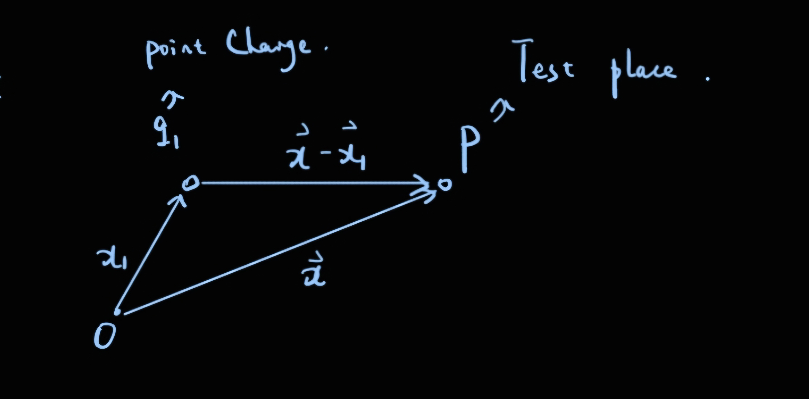
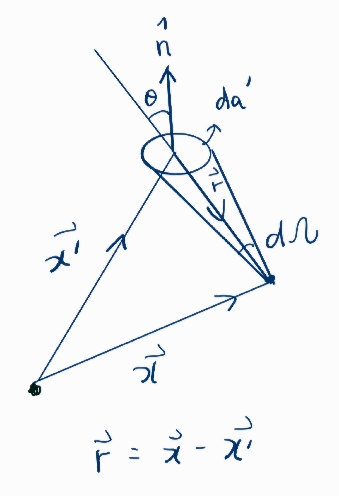

# Chap1：Introduction to ElectroStatics 

## Coulomb's law(库伦定律)

库伦通过一系列的实验表明，在空气中两个相距较远的（相比于带电体本身的尺寸而言）静止的带电体（小的）之间的作用力：

1. 作用力与两个带电体所带的电荷量（$q_1,q_2$）成正比.
2. 与两个带电体之间的距离r的平方成反比
3. 作用力的方向沿着两个带电体的连线方向
4. 对于同号电荷，作用力使得两者相互远离，对于异号电荷，作用力使得两者相互靠近
5. 作用力的行为是向量，因此，对于分析多个带电体对于某一点的作用力，我们可以使用向量的线性叠加的规则。

## Electric field(电场)

虽然有许多实验测量电荷之间的库伦作用力，但是电场在科学家的群体中更加受到关注，电场的定义是：$\mathbf{E}= \frac{\mathbf{F}}{q}$ ,即对于某一个电荷 $q_1$在某一处 $\mathbf{x}$ 的电场可以用该处试探电荷q所受到q1的库伦作用力除以试探电荷的电荷量得到。

通过Coulomb's law，我们可以得到位于$\mathbf{x_1}$的点电荷 $q_1$对于位于 $\mathbf{x}$的测试电荷q的作用力的表达式为：
$$
\mathbf{F} = kq_1q \frac{(\mathbf{x-x_1})}{\abs{\mathbf{x-x_1}}^3}
$$
其中 k是一个常量，在SI单位制下 $k = \frac{1}{4\pi \epsilon_0},\epsilon_0为真空介电常数$。

因此我们就可以通过前面对于电场的定义得到点电荷 $q_1$在任意位置 $\mathbf{x}$的电场 $\mathbf{E(x)}$ 为：
$$
\mathbf{E}(\mathbf{x}) = kq_1\frac{\mathbf{x-x_1}}{\abs{\mathbf{x-x_1}}^3}
$$
然后由单个电荷在某一位置的电场，就可以矢量叠加得到多个电荷 $\{q_i\}$在 $\mathbf{x}$处的总电场为：
$$
\mathbf{E}(\mathbf{x}) = k\sum_i{q_i}\frac{\mathbf{x}-\mathbf{x_i}}{\abs{\mathbf{x}-\mathbf{x_i}}^3}
$$
如果这些电荷很小并且数量很大，在 $\mathbf{x}'$处小体积 $d^3x' = dxdydz$的电荷 $dq$ 由该位置的电荷密度 $\rho(\mathbf{x}’)$ 表示为：
$$
dq = \rho(\mathbf{x}')dxdydz = \rho(\mathbf{x'})d^3x'
$$
因此对于电荷分布为 $\rho(\mathbf{x}')$的带电体，在任意位置处的电场强度为：
$$
\mathbf{E}(\mathbf{x}) = \frac{1}{4\pi\epsilon_0}\int\rho(\mathbf{x'})\frac{\mathbf{x}-\mathbf{x'}}{\abs{\mathbf{x}-\mathbf{x'}}^3}d^3x'
$$
为了从连续电荷分布的电场强度得到离散分布的电场强度（即式2），我们引入Dirac Delta Function $\delta{(x-a)}$:

1. $\delta(x-a) = 0$ 当x不等于a时恒成立

2. $\int \delta(x-a)dx $ 这个积分在积分路径包含x = a这一点时为1，不包含时为0

3. $\int\delta(x-a)f(x)dx = f(a)$ ,这里的积分路径如果不包含x = a,那么积分就为0

4. $\int \delta'(x-a)f(x)dx = -f'(a)$ ,这个式子可以通过分步积分导出

5. 变量替换的一个等式：
$$
   \delta(f(x)) = \sum_i \frac{1}{\abs{\frac{df}{dx}(x_i)}}\delta(x-x_i)
$$

6. $\delta(\mathbf{x}-\mathbf{X}) = \delta(x_1-X_1)\delta(x_2-X_2)\delta(x_3-X_3)$
7. $\int_{\triangle{V}}\delta(\mathbf{x}-\mathbf{X})$ 这个三维积分当积分空间不包含 $\mathbf{x} = \mathbf{X}$这个点时等于0，包含时等于1.

由Dirac Delta Function，我们就可以定义离散分布电荷的电荷密度 $\rho(\mathbf{x})$为：
$$
\rho(\mathbf{x}) = \sum^n_{i = 1}q_i \delta(\mathbf{x}-\mathbf{x_i})
$$
将式7代入连续分布的电场强度就可以得到离散分布的电场强度的公式（即通过每一个电荷在该点电场的线性叠加而成的电场）：
$$
\mathbf{E}(\mathbf{x}) = \frac{1}{4\pi\epsilon_0}\sum_{i=1}^{n}q_i\frac{\mathbf{x-x_i}}{\abs{\mathbf{x-x_i}}^3}
$$

## Gauss's Law(高斯定律)

高斯定律考虑一个点电荷q在一个封闭曲面S上某一处 $dS$ 的电场通量 $\mathbf{E}\cdot \mathbf{n}dS$，根据电场的定义得到：
$$
d\Phi = \mathbf{E}\cdot \mathbf{n}dS = \frac{1}{4\pi\epsilon_0}q \frac{\cos{\theta}dS}{r^2}
$$
其中 $\theta$是小面元dS的法向量 $\mathbf{n}$ (单位向量)和电场E所成的夹角。

根据立体角（Solid Angle）的定义：
$$
d\Omega = \frac{\mathbf{n}\cdot\mathbf{r}}{r^3}dS
$$
因此可以得到 $d\Phi$为：
$$
d\Phi = \frac{1}{4\pi\epsilon_0}q d\Omega
$$
因此，对于整个封闭曲面电场通量的积分为：
$$
\oint_{S} \mathbf{E} \cdot \mathbf{n} dS =
\begin{cases}
\frac{q}{\varepsilon_0} & \text{if } q \text{ 在 } S \\\\
0 & \text{if } q \text{ 不在 } S
\end{cases}
$$
如果考虑封闭曲面内部的电荷 $\sum_i q_i$，则这个积分为：
$$
\oint_{S} \mathbf{E} \cdot \mathbf{n} dS = \frac{\sum_iq_i}{\epsilon_0}
$$
考虑电荷是连续的情况：
$$
\oint_{S} \mathbf{E} \cdot \mathbf{n} dS = \int_V \frac{\rho(\mathbf{x})d^3x}{\epsilon_0}
$$
上式就是高斯定理的标准形式，可以通过推导过程看出，高斯定理依赖于下面的几个属性：

1. 电荷之间作用力的平方反比关系
2. 电荷之间相互作用力的有心的特性
3. 对于不同电荷对于同一个地方电场的矢量的线性叠加

##  Differential Form of Gauss's Law (高斯定理的微分形式)

根据散度定理（divergence Theorem）：
$$
任意良定义的矢量场(\mathbf{A(x)}),对于空间中的任意一个区域V，以及围绕它的封闭曲面S，有： \\\\
\oint_S \mathbf{A}\cdot\mathbf{n} \,da = \int_V \grad \cdot \mathbf{A} d^3x
$$
由散度定理可以高斯定理的微分形式：
$$
\grad \cdot \mathbf{E} = \frac{\rho(\mathbf{x})}{\epsilon_0}
$$
但是如果我们需要确定空间中某一点处的电场，只知道电场的散度还不够。

由Helmholtz Theorem：

> 在适当的条件下（要求向量场在空间中足够"良好"，eg：在趋于无穷大时快速衰减或者满足一定的边界条件），任何一个三维的向量场 $\mathbf{F}(\mathbf{r})$都可以唯一地分解为两个部分（无旋部分，有旋部分）：
> $$
> \mathbf{F}(\mathbf{r}) = -\nabla\phi(\mathbf{r})+\nabla\cross A(\mathbf{r})
> $$

因此如果我们要确定空间中某一处的电场，若我们只知道电场的散度，也就是知道了电场的无旋部分，那么我们就还需要知道电场的旋度，得到电场的无散部分。（这里是因为：无旋部分的旋度是0，所以该部分就是电场的散度，而无散部分的散度是0，因此电场的旋度就是无散部分。）

那么我们来计算一下电场的旋度 $\nabla \cross \mathbf{E}$,首先根据式5的定义：
$$
\mathbf{E}(\mathbf{x}) = \frac{1}{4\pi\epsilon_0}\int_{V}\rho(\mathbf{x'})\frac{\mathbf{x}-\mathbf{x'}}{\abs{\mathbf{x}-\mathbf{x'}}^3} d^3x'= \frac{1}{4\pi\epsilon_0}\int_{V}\rho(\mathbf{x'})\grad_{x}(\frac{1}{\abs{\mathbf{x}-\mathbf{x}'}})d^3x'
$$
因此( $\frac{\mathbf{x}-\mathbf{x}'}{\abs{\mathbf{x}-\mathbf{x'}}^3} = -\grad_x(\frac{1}{\abs{\mathbf{x}-\mathbf{x}'}})=-\grad_{x'}(\frac{1}{\abs{\mathbf{x}-\mathbf{x}'}})$)，电场的旋度：
$$
\grad \cross \mathbf{E} = \grad_x \cross (-\frac{1}{4\pi \epsilon_0}\int \rho(\mathbf{x}')\grad_{x}(\frac{1}{\abs{\mathbf{x}-\mathbf{x}'}})d^3x') \\\\
= -\frac{1}{4\pi \epsilon_0} \grad_x \cdot (\grad_x \int \frac{\rho(\mathbf{r'})}{\abs{\mathbf{x}-\mathbf{x}'}}d^3x') \\\\
= 0
$$
由此就证明了在空间中任意一处，电场的旋度都是0。

由上面的证明可以得出一个好用的计算公式：
$$
\mathbf{E}(\mathbf{x}) = -\frac{1}{4\pi \epsilon_0}\grad\int \frac{\rho(\mathbf{x'})}{\abs{\mathbf{x}-\mathbf{x}'}}d^3x'
= -\grad \Phi(\mathbf{x})
$$
其中 $\Phi(\mathbf{x})$是一个标量函数（这里的标量函数指的是Map: $\R^3 \to \R $，也就是当我们指定了三维空间中的一个点( $\mathbf{x}$)，那么这个函数就会给我们返回一个 $\Phi(\mathbf{x})$），称为Scalar Potential：
$$
\Phi(\mathbf{x}) =\frac{1}{4\pi \epsilon_0}\int_V \frac{\rho(\mathbf{x'})}{\abs{\mathbf{x-x'}}}d^3x'
$$
其中 $\mathbf{x}$指的是场点（即我们研究的地方），$\mathbf{x'}$指的是源点（也就是发出电场的地方）

因此可以通过计算空间中各点处的电势，然后求负梯度，来获得空间处各点的电场，这个方法比依靠电场的定义来直接计算更加方便，因为一个是计算矢量，而这个是计算标量。

**Tips:下文中的向量都用 $\mathbf{E}$粗体**

## The Potential $\Phi(\mathbf{x})$

首先，上面我们得到了电势和电场的关系：
$$
\mathbf{E}(\mathbf{x}) = -\grad\Phi(\mathbf{x})
$$
由之前的库伦定律，一个电荷q在这个电场中所受的力 $\mathbf{F} = \mathbf{E}q$，那么如果我们考虑从某一点A将电荷q移到点B说需要做的功W（应该与库伦力所做的功恰好抵消，所以W与电场力所做的功相加等于0）:
$$
W= -\int_A^B \mathbf{F}\cdot \mathbf{dl} = -\int_A^B q\mathbf{E}\cdot \mathbf{dl} \\\\
=\int_A^B -q\grad\Phi(\mathbf{x})\cdot \mathbf{dl} = q\int_A^B\grad{\Phi(\mathbf{x})}\cdot \mathbf{dl} = q(\Phi_B-\Phi_A)
$$
其中 $q\Phi$表示测试电荷在该电场下的势能（Potential Energy）

电场对于A到B的路径的积分为：
$$
\int_A^B \mathbf{E} \cdot d\mathbf{l} = -(\Phi_B-\Phi_A)
$$
可以发现电场对于路径的积分只与初末位置的电势差相关，因此当路径闭合的时候有：
$$
\oint \mathbf{E}\cdot d\mathbf{l} = 0
$$
这个结论也可以很快地从Stokes Theorem 得出：

> Stokes's Theorem:
>
> ​	如果$\mathbf{A(x)} $是一个well -behaved 的向量场，S是一个任意的open surface，C是包围S的一个闭合曲线，则：
> $$
> \oint_C \mathbf{A} \cdot d\mathbf{l} = \int_S (\grad \cross \mathbf{A})\cdot \mathbf{n} da
> $$
> 其中dl是C上的线元，然后 $\mathbf{n}$是S的法向量，C的曲线方向与 $\mathbf{n}$的方向呈右手螺旋关系

那么根据这个定理，take  $\mathbf{A} = \mathbf{E}$ ，有：
$$
\oint_C \mathbf{E} \cdot d\mathbf{l} = \int_S (\curl \mathbf{E})\cdot \mathbf{n}\,da
$$
因为电场的curl等于0，所以就得到了电场沿着任意闭合曲线的路径积分都为0.

---

## 1.6 Surface Distribution of charges and Dipoles and Discontinuities in the Electric Field and Potential（偶极子与电荷的面分布，以及它们的电势和电场之间不连续性）

### 1. 面电荷分布：

首先假设有一个曲面S，上面的面电荷密度是 $\sigma(\mathbf{x})$ , 然后这个曲面有两个side，我们现在考虑x处电场对于该处法向的不连续性，根据Gauss Law，如果我们在x处画一个小圆柱，圆柱的上下两个面的方向都是曲面的法向（在side1那个面的法向量与n相反），有：
$$
\int_V \div \mathbf{E}\,\, d^3\mathbf{x} = \oint_S \mathbf{E}\cdot \mathbf{n}\, da = \frac{Q_{\in V}}{\epsilon_0}
$$
因此对于这个小圆柱而言右边的面积分的贡献只有上下两个面（因为这个小圆柱的高趋近于0）,then:
$$
(\mathbf{E_2}\cdot \mathbf{n} - \mathbf{E_1}\cdot\mathbf{n})da = \frac{\sigma(\mathbf{x})da}{\epsilon_0} \\\\
\mathbf{(E_2-E_1)} \cdot \mathbf{n} = \frac{\sigma(\mathbf{x})}{\epsilon_0}
$$
这个就是对于面电荷分布，在法向电场的不连续性。

在切向电场具有连续性，我们可以通过构造一个垂直于 $\mathbf{da}$的小矩形框。根据，对于任何闭合路径而言，电场对于路径的积分都是0，于是我们可以将在两个side的电场都投影到两个矩形框的边上，也就是电场的切向分量，那么很容易得到：在面电荷分布下，电场的切向分量是连续的，即：
$$
\mathbf{(E_2-E_1)}\cross \mathbf{n} = 0
$$
然后对于面电荷分布在空间中的电势分布：
$$
\Phi(\mathbf{x}) = \frac{1}{4\pi\epsilon_0} \int_S \frac{\sigma{(\mathbf{x'}})}{\abs{\mathbf{x-x'}}} \,da'
$$
对于体电荷或者面电荷而言，甚至在电荷分布内部，电势的分布都是连续的。

这一点可以通过电场 $\mathbf{E}$ 是有界的（良定义（well-behaved）的vector field）来证明：

> Prove：
>
> ​	首先根据E是有界的（通常情况下），存在一个常数M小于无穷大，使得：
> $$
> \abs{\mathbf{E(x)}} \leq M \:,对于在空间内的所有位置 \mathbf{x} 均成立
> $$
> ​	然后根据电场于电势之间的关系 $\mathbf{E} = -\grad\Phi$,选取空间中非常靠近的两个点 $\mathbf{x_1,x_2}$,并且在它们之间构建一条很短的路径（路径长度趋于0），做 电场关于这个路径的积分，得到：
> $$
> \int_{x_1 \to x_2} \mathbf{E}\cdot d\mathbf{l} = -\int_{x_1}^{x_2}\grad\Phi \cdot d\mathbf{l} = \Phi(\mathbf{x_1})-\Phi(\mathbf{x_2})
> $$
> 左边当这个路径的长度趋于0并且电场时有界的时候，左边的积分趋于0，则最终得到空间中两个任意靠近的点之间的电势是相等的。若整个空间的电场有界，则这个空间的电势是连续的。 证毕。

上面证明了面电荷分布下的电场的不连续性和证明在E有界的情况下电势通常是连续，然后我们讨论一个特例，就是dipole-layer的potential $\Phi(\mathbf{x})$ .

首先什么是一个dipole-layer（偶极子层），对于一个偶极子来说，它的电偶极矩 $\mathbf{p} = qd(方向从负电荷指向正电荷)$，对于dipole-layer而言就是有多个偶极子所构成的曲面(可以见下图)，也可以想象成两个距离很近的面电荷分布S，S'（一正一负）。

###### 

首先，对于这样一个dipole-layer 而言，我们需要定义偶极子的分布强度 $D(\mathbf{x})$:
$$
\lim_{d(\mathbf{x})\to0} \sigma(\mathbf{x})d(\mathbf{x})= D(\mathbf{x})
$$
其实我们也可以从偶极子的定义出发推导这个定义：

> ###### 首先偶极子的电偶极矩定义是 $p = qd$，这个dipole-layer它的分布强度，其实是在一个小面积上的电偶极矩有多大，在dipole-layer的曲面上取一个小面元da,在它上面的电偶极矩dp就会是 $dp = lim_{d\to0}(\sigma(\mathbf{x}) da)d(\mathbf{x})$，最后我们通过积分得到：
>
> $$
> p(\mathbf{x}) = \lim_{d\to 0}\sigma(\mathbf{x})d(\mathbf{x}) S
> $$
>
> 这个是整个曲面上的电偶极矩的大小，但是我们要得到的是这个曲面上的电偶极矩的密度，然后我们两边除以曲面的面积得到：
> $$
> D(\mathbf{x}) = \lim_{d\to 0}\sigma(\mathbf{x})d(\mathbf{x})
> $$
>

得出dipole-layer 分布强度的定义之后，我们想要看一下对于这个电荷分布而言，它的电势分布是怎么样的？

根据电势的定义：
$$
\Phi(\mathbf{x}) = \int_{V} \frac{\rho(\mathbf{x'})}{\abs{\mathbf{x-x'}}}d^3x'
$$
对于面电荷分布 $\sigma(\mathbf{x'})$而言，电势为：
$$
\Phi(\mathbf{x}) = \int_{S} \frac{\sigma(\mathbf{x'})}{\abs{\mathbf{x-x'}}}da'
$$
则dipole-layer在场点 $\mathbf{x}$处的电势等于两个面电荷分布的叠加：
$$
\Phi(\mathbf{x}) = \Phi_{S}(\mathbf{x})+\Phi_{S'}(\mathbf{x})
$$
dipole-layer的几何信息如下图(O是参考点，其中 $d(\mathbf{x'})$表示在Surface S的 $\mathbf{x'}$与S'的距离函数，这个函数对于dipole-layer来说各处都趋于0)：

通过上面的几何关系就可以写出dipole-layer 在x处电势的表达式：
$$
\Phi(\mathbf{x}) = \Phi_{S}(\mathbf{x})+\Phi_{S'}(\mathbf{x}) \\\\
= \frac{1}{4\pi\epsilon_0}\int_{S} \frac{\sigma(\mathbf{x'})}{\abs{\mathbf{x-x'}}}da'+ \frac{1}{4\pi\epsilon_0}\int_{S'} \frac{\sigma(\mathbf{x''})}{\abs{\mathbf{x-x'+n}d}}da''
$$
然后根据两个曲面的面电荷密度相反有：
$$
\Phi(\mathbf{x}) =\frac{1}{4\pi\epsilon_0}\int_{S} \frac{\sigma(\mathbf{x'})}{\abs{\mathbf{x-x'}}}da'- \frac{1}{4\pi\epsilon_0}\int_{S'} \frac{\sigma(\mathbf{x''})}{\abs{\mathbf{x-x'+n}d}}da''
$$
对于第二项，对于Dipole-layer而言d在各处都非常小，那么对于 $\frac{1}{\abs{\mathbf{x-x'+n}d}}$在 x-x'+nd 接近x-x'的位置做Taylor Expansion 有：
$$
\frac{1}{\abs{\mathbf{x-x'+n}d}} = \frac{1}{\abs{\mathbf{x-x'}}}+d(\mathbf{x'})\mathbf{n}\cdot \grad_x{\frac{1}{\abs{\mathbf{x-x'}}}} + \dots
$$
因此带回式（41）：
$$
\Phi(\mathbf{x}) =\frac{1}{4\pi\epsilon_0}\int_{S} \frac{\sigma(\mathbf{x'})}{\abs{\mathbf{x-x'}}}da'- \frac{1}{4\pi\epsilon_0}\int_{S'} \sigma(\mathbf{x'})(\frac{1}{\abs{\mathbf{x-x'}}}+d(\mathbf{x'})\mathbf{n}\cdot \grad_x{\frac{1}{\abs{\mathbf{x-x'}}}})da'' \\\\
=\frac{1}{4\pi\epsilon_0}\int_{S} \frac{\sigma(\mathbf{x'})}{\abs{\mathbf{x-x'}}}da'- \frac{1}{4\pi\epsilon_0}\int_{S'} \sigma(\mathbf{x'})\frac{1}{\abs{\mathbf{x-x'}}}da''-\frac{1}{4\pi\epsilon_0}\int_{S'}\sigma(\mathbf{x'})d(\mathbf{x'})\mathbf{n}\cdot \grad_x{\frac{1}{\abs{\mathbf{x-x'}}}}da''
$$
然后代入条件，对于dipole-layer而言两个曲面的距离d趋于0，因此前两项抵消，然后S几乎等于S' ，da'' 几乎等于da',以及 $D(\mathbf{x}) = \lim_{d\to 0}\sigma(\mathbf{x})d(\mathbf{x})$，有：
$$
\Phi(\mathbf{x}) = -\frac{1}{4\pi\epsilon_0}\int_{S} D(\mathbf{x'})\mathbf{n}\cdot \grad_x{\frac{1}{\abs{\mathbf{x-x'}}}}da' =\frac{1}{4\pi\epsilon_0}\int_{S} D(\mathbf{x'})\mathbf{n}\cdot \grad_{\mathbf{x'}}{\frac{1}{\abs{\mathbf{x-x'}}}}da'
$$
其中 单位向量$\mathbf{n}$的方向就是dipole-layer曲面S的法向量也是这个dipole-layer此处的电偶极矩的方向，在最后一个等号对grad的变量做了一个变换（$x\to x'$），所以前面的负号抵消了。

> 观察式（44），积分里面包含着一个点电偶极子的电偶极矩 $\mathbf{p = n}Dda'$,因为一个dipole-layer可以看成由很多个靠的很近的电偶极子组合而成，那么dipole-layer产生的电势也可以由各个电偶极子所产生的电势叠加而成，根据算到的dipole-layer的电势，我们可以得到一个在 $\mathbf{x'}点电偶极子$在 $\mathbf{x}$处造成的电势为：
> $$
> \Phi(\mathbf{x}) = \frac{1}{4\pi\epsilon_0}\frac{\mathbf{p\cdot(x-x')}}{\abs{\mathbf{x-x'}}^3}
> $$
> 其中：$\grad_{x'}\frac{1}{\abs{\mathbf{x-x'}}} = \frac{\mathbf{(x-x')}}{\abs{\mathbf{x-x'}}^3}=-\grad_x \frac{1}{\abs{\mathbf{x-x'}}}$

式(44)的几何解释

> 我们发现：
> $$
> \mathbf{n} \cdot \grad_{\mathbf{x'}}(\frac{1}{\abs{\mathbf{x-x'}}})da'=\mathbf{n\cdot\frac{\mathbf{(x-x')}}{\abs{\mathbf{x-x'}}^3}}da'
> $$
> 这个式子的右边很像立体角的定义：
> $$
> d\Omega = \frac{\mathbf{n\cdot{r}}}{r^3}da
> $$
> 式46即从 $\mathbf{x}$观察位于 $\mathbf{x'}$的面元da'的立体角，如下图:
>
> 
>
> 因此我们就可以得出：
> $$
> \mathbf{n} \cdot \grad_{\mathbf{x'}}(\frac{1}{\abs{\mathbf{x-x'}}})da'=\mathbf{n\cdot\frac{\mathbf{(x-x')}}{\abs{\mathbf{x-x'}}^3}}da'=-d\Omega
> $$
> 最后我们得到，dipole-layer在点 $\mathbf{x}$处的电势：
> $$
> \Phi(\mathbf{x}) = -\frac{1}{4\pi\epsilon_0} \int_S D(\mathbf{x'})d\Omega
> $$
>

通过电势的几何解释，可以说明dipole-layer两侧的电势跳变：

>首先，如果考虑离S表面很近的一个点，从这个点观察S面的立体角几乎是-2$\pi$(因为此时，这个S表面对于这个点而言就像一个圆盘（disk),考虑方向的话，这个立体角是负的。我们可以看到对于离一个无限大平面有一定距离的点，这个平面对于这个点的立体角为0，因为看不到边界)，并且对于这个点而言这个圆盘的表面电偶极矩的密度是恒定的，因此D在这个情况下是均匀的，所以对于S上方的点他的电势为：
>$$
>\Phi_{S+} = -\frac{D}{4\pi\epsilon_0}\cdot (-1)2\pi = \frac{D}{2\epsilon_0}
>$$
>同样的对于S'下方一个很近的点，它的立体角就是 $+2\pi$,则：
>$$
>\Phi_{S'-}=-\frac{D}{4\pi\epsilon_0}\cdot(2\pi) = -\frac{D}{2\epsilon_0}
>$$
>因此对于dipole-layer两侧的电势跳变是：
>$$
>\Phi_{S+} -\Phi_{S'-}= \frac{D}{\epsilon_0}
>$$

---

## 1.7 Poisson and Laplace Equations

在前面我们的得到了电场的两个属性，一个 $\div \mathbf{E}$（散度），一个curl $\curl{\mathbf{E}}$（旋度）：
$$
\div \mathbf{E} = \frac{\rho}{\epsilon_0} \, ,\curl\mathbf{E} = 0
$$
在推导电场的旋度为零的时候又自然的得出了一个性质：

> 对于一个vector field $\mathbf{E}$而言，如果其旋度为零，则存在一个scalar field $ \Phi$，s.t ：
> $$
> \curl{\mathbf{E}}= 0 \to\mathbf{E} = -\grad{\Phi}
> $$

于是结合电场散度与旋度的推论，得出Possion equation：
$$
\nabla^2\Phi = -\frac{\rho}{\epsilon_0}
$$
若讨论的空间区域中电荷密度为0，则Possion equation退化为Lapalce equation：
$$
\nabla^2 \Phi = 0
$$

### Possion equation的验证：

之前我们已经得到了任意的电荷密度对于空间中任意一点 $\mathbf{x}$ 的电势 $\Phi$ 的表达式：
$$
\Phi(\mathbf{x})= \frac{1}{4\pi\epsilon_0}\int_V \frac{\rho(\mathbf{x'})}{\abs{\mathbf{x-x'}}} d^3x'
$$
那么如果想要验证Possion equation，两边都作用Laplacian（$\nabla^2$)，则需要验证：
$$
\nabla^2 \Phi(\mathbf{x}) = \nabla^2(\frac{1}{4\pi\epsilon_0}\int_V \frac{\rho(\mathbf{x'})}{\abs{\mathbf{x-x'}}} d^3x')
$$
但是在验证之前，我们做一个极限处理，定义一个“a- Potential”：
$$
\Phi_a(\mathbf{x}) =\frac{1}{4\pi\epsilon_0}\int_V \frac{\rho(\mathbf{x'})}{\sqrt{(\mathbf{x-x'})^2+a^2}} d^3x'
$$
则有：
$$
\lim_{a\to0}\nabla^2\Phi_a(\mathbf{x}) = \nabla^2\Phi(\mathbf{x}) = -\frac{\rho}{\epsilon_0}
$$
则证明前面对于a-potential的极限等于右边，我们对a-potential做出一些处理：考虑到 $\frac{1}{\abs{\mathbf{x-x'}}}$具有一定的球对称性，我们假设 $r = \abs{\mathbf{x-x'}}$，r 从0到无穷，大则证：
$$
\lim_{a\to 0} \nabla^2 \frac{1}{4\pi\epsilon_0}\int_V \frac{\rho(\mathbf{x'})}{\sqrt{r^2+a^2}} d^3x'
$$
因为外面的拉普拉斯算子是对 $\mathbf{x}$作用的，而积分变量是 $\mathbf{x'}$ ,因此可以简化为：
$$
\frac{1}{4\pi\epsilon_0}\int_V \rho(\mathbf{x'})\lim_{a\to 0}\nabla^2(\frac{1}{\sqrt{r^2+a^2}}) d^3x'
$$
我们先处理一下 $\nabla^2(\frac{1}{\sqrt{r^2+a^2}})$:
$$
\nabla^2(\frac{1}{\sqrt{r^2+a^2}}) = (\grad)\cdot(\hat{\mathbf{i}}\frac{\partial}{\partial{x_1}}+\hat{\mathbf{j}}\frac{\partial}{\partial{y_1}}+\hat{\mathbf{k}}\frac{\partial}{\partial{z_1}})(\frac{1}{\sqrt{r^2+a^2}})) \\\\
=(\grad)\cdot(\hat{\mathbf{i}}\frac{\partial}{\partial{x_1}}(\frac{1}{\sqrt{r^2+a^2}})+\hat{\mathbf{j}}\frac{\partial}{\partial{y_1}}(\frac{1}{\sqrt{r^2+a^2}})+\hat{\mathbf{k}}\frac{\partial}{\partial{z_1}}(\frac{1}{\sqrt{r^2+a^2}})) \\\\
=(\hat{\mathbf{i}}\frac{\partial}{\partial{x_1}}+\hat{\mathbf{j}}\frac{\partial}{\partial{y_1}}+\hat{\mathbf{k}}\frac{\partial}{\partial{z_1}})\cdot (-\hat{\mathbf{i}}\frac{(x_1-x_1')}{(r^2+a^2)^{3/2}}-\hat{\mathbf{j}}\frac{(y_1-y_1')}{(r^2+a^2)^{3/2}}-\hat{\mathbf{k}}\frac{(z_1-z_1')}{(r^2+a^2)^{3/2}}) \\\\
= \frac{3(x_1-x_1')^2-r^2-a^2}{(r^2+a^2)^{5/2}}+\frac{3(y_1-y_1')^2-r^2-a^2}{(r^2+a^2)^{5/2}}+\frac{3(z_1-z_1')^2-r^2-a^2}{(r^2+a^2)^{5/2}} \\\\
\nabla^2(\frac{1}{\sqrt{r^2+a^2}})=\frac{3r^2-3r^2-3a^2}{(r^2+a^2)^{5/2}} = \frac{-3a^2}{(r^2+a^2)^{5/2}}
$$
其中r = $\sqrt{(x_1-x_1')^2+(y_1-y_1')^2+(z_1-z_1')^2} = \abs{\mathbf{x-x'}},\mathbf{x} = (x_1,y_1,z_1)$, 因此上面的积分为：
$$
\lim_{a\to0} \nabla^2 \Phi_a(\mathbf{x}) =\lim_{a\to 0 }(\frac{1}{4\pi\epsilon_0}\int_V \rho(\mathbf{x'}) \frac{-3a^2}{(r^2+a^2)^{5/2}} d^3x')
$$
对于上式右边的积分，可以看到当a趋于0的时候，若r等于0，则这个积分趋于无穷大，若r不等于0 则这个积分为0，但是我们可以证明在a取任意值的情况下（a不一定为0），这个积分 $\int_V \frac{-3a^2}{(r^2+a^2)^{5/2}} d^3x'= 4\pi$:

> For arbitary a, the integral $\int_V \frac{-3a^2}{(r^2+a^2)^{5/2}} d^3x'= 4\pi$
>
> Prove:
> $$
> \int_V \frac{-3a^2}{(r^2+a^2)^{5/2}} d^3x' =-\int_0^{4\pi} d\Omega \int_0^{\infin} r^2dr\frac{3a^2}{(r^2+a^2)^{5/2}} \\\\
> =-4\pi \int_{0}^{\frac{\pi}{2}} 3\sin^2{t}\cos{t} \, dt \\\\
> = -4\pi \quad \left( r = a\tan{t} \right)
> $$
>

通过上面的证明与分析可以看出对于函数 $\lim_{a\to0}\nabla^2(\frac{1}{\sqrt{r^2+a^2}}) = -4\pi\delta({\mathbf{x-x'}}) $,理由是对于这个函数对于V积分的时候，若积分区域中不包含x = x'的这个点，那么这个积分就是0，如果积分区域包含这个点，那么对于任意的a而言，这个函数在这个区域的积分是 $-4\pi$，因此这个函数的性质与delta函数在积分上的性质一致，因此可以等价。

到此，式（62）的积分可以写为：
$$
\lim_{a\to0}\Phi_a(\mathbf{x})=\frac{1}{4\pi\epsilon_0}\int_V \rho(\mathbf{x'})\lim_{a\to 0}\nabla^2(\frac{1}{\sqrt{r^2+a^2}}) d^3x' = \frac{1}{4\pi\epsilon_0}\int_V \rho(\mathbf{x'})(-4\pi\delta(\mathbf{x-x'})) d^3x' = -\frac{\rho}{\epsilon_0}
$$
于是Possion Equation就被证明了。

> 另一种证明思路（暂时停止，数学过程太多了，感觉没有表示清楚）：
> $$
> \lim_{a\to0} \nabla^2 \Phi_a(\mathbf{x}) =\lim_{a\to 0 }(\frac{1}{4\pi\epsilon_0}\int_V \rho(\mathbf{x'}) \frac{-3a^2}{(r^2+a^2)^{5/2}} d^3x')
> $$
> 由于积分的球对称性，我们可以将常规的体积分转化为球坐标系下的积分：
> $$
> \lim_{a\to 0 }(\frac{1}{4\pi\epsilon_0}\int_V \rho(\mathbf{x'}) \frac{-3a^2}{(r^2+a^2)^{5/2}} d^3x') = \lim_{a\to 0 }(\frac{-1}{4\pi\epsilon_0}\int_0^{4\pi} d\Omega\int_0^{\infin}r^2dr\rho(\mathbf{x'}) \frac{-3a^2}{(r^2+a^2)^{5/2}})
> $$
> 对于上面的积分，可以观察到，如果我们以$\mathbf{x}$为中心画一个半径为R的小球（R很小，但a远小于R）并且在小球内电荷的体密度几乎处处相等，但当积分变量在这个球外面，r不等于0，但是积分里面的函数却以 $a^2$的数量级趋于0，因此整个积分可以忽略r大于R的区域，则：
> $$
> \lim_{a\to 0 }(\frac{-1}{4\pi\epsilon_0}\int_0^{4\pi} d\Omega\int_0^{R}r^2dr\rho(\mathbf{x'}) \frac{-3a^2}{(r^2+a^2)^{5/2}}) = \lim_{a\to 0} \frac{-1}{4\pi\epsilon_0} P(a)
> $$
> 在这个区域内，电荷的体密度可以在x'趋近于x时做Taylor Expansion(Scalar function of three variables)，
>
> 首先对于 电荷密度这样的Scalar function $f(\mathbf{x})$ :$ \R^n \to\R$ ，有在 $\mathbf{a}$的Taylor Expansion($\mathbf{h=x-a} $,它也是n维向量空间中的一个列向量)：
> $$
> f(\mathbf{x}) = f(\mathbf{a}) +\grad{f(\mathbf{a})}\cdot \mathbf{h}+\frac{1}{2}\mathbf{h^T H_f(a)h} + \frac{1}{3!}\sum_{i,j,k=1}^{n} \frac{\partial^3 f}{\partial{x_i}\partial{x_j}\partial{x_k}}(\mathbf{a})h_i h_j h_k +\dots
> $$
> 其中，$\grad{f(\mathbf{a})}$是一个行向量（row），定义是$\grad{f(\mathbf{a})} = (\frac{\partial{f}}{\partial{x_1}}(a),\dots,\frac{\partial{f}}{\partial{x_n}}(a))$，以及 $\mathbf{H_f}(x)$是Hessian Matrix：
> $$
> H_f(\mathbf{x}) = \begin{bmatrix} \frac{\partial^2 f}{\partial x_1^2} & \frac{\partial^2 f}{\partial x_1\partial x_2} & \cdots & \frac{\partial^2 f}{\partial x_1\partial x_n}\\\\ \frac{\partial^2 f}{\partial x_2\partial x_1} & \frac{\partial^2 f}{\partial x_2^2} & \cdots & \frac{\partial^2 f}{\partial x_2\partial x_n}\\\\ \vdots & \vdots & \ddots & \vdots\\\\ \frac{\partial^2 f}{\partial x_n\partial x_1} & \frac{\partial^2 f}{\partial x_n\partial x_2} & \cdots & \frac{\partial^2 f}{\partial x_n^2} \end{bmatrix}.
> $$
> 因此，对于电荷密度这样的Scalar Function，有($\mathbf{h=x-x'}=(x_1-x_1',x_2-x_2',x_3-x_3')$)：
> $$
> \rho(\mathbf{x'}) = \rho(\mathbf{x})+\grad\rho(\mathbf{x})\cdot\mathbf{h}+\frac{1}{2}\mathbf{h^T H_{\rho}(x)h}+\dots
> $$
> 此时P(a)变为：
> $$
> P(a)= \int_0^{4\pi} d\Omega\int_0^{R}r^2dr [\rho(\mathbf{x})+\grad\rho(\mathbf{x})\cdot\mathbf{h}+\frac{1}{2}\mathbf{h^T H_{\rho}(x)h}+\dots] \frac{-3a^2}{(r^2+a^2)^{5/2}})
> $$
> 那么对于常数项 $\rho(\mathbf{x})$而言，对于这个积分的贡献就是 $-4\pi\rho(\mathbf{x})$。
>
> 一次项 $\grad\rho(\mathbf{x})\cdot\mathbf{h}=\frac{\partial{\rho}}{\partial{x_1}}(\mathbf{x})(x_1-x_1')+\frac{\partial{\rho}}{\partial{x_2}}(\mathbf{x})(x_2-x_2')+\frac{\partial{\rho}}{\partial{x_3}}(\mathbf{x})(x_3-x_3')$对这个积分的贡献:
> $$
> (1)\int_0^{4\pi} d\Omega\int_0^{R}r^2dr \frac{\partial{\rho}}{\partial{x_1}}(\mathbf{x})(x_1-x_1')\frac{-3a^2}{(r^2+a^2)^{5/2}} \\\\
> \propto \int_0^{4\pi} d\Omega\int_0^{R}r^2dr \frac{\partial{\rho}}{\partial{x_1}}r\sin{\theta}\cos{\phi}\frac{-3a^2}{(r^2+a^2)^{5/2}} \\\\
> = \int_0^{2\pi}\cos{\phi}d \phi\int_0^{\pi}\sin^2{\theta}d\theta\int_0^{R} \frac{\partial{\rho}}{\partial{x_1}}\frac{-3a^2r^3}{(r^2+a^2)^{5/2}}dr =0 \\\\
> (2)\int_0^{4\pi} d\Omega\int_0^{R}r^2dr \frac{\partial{\rho}}{\partial{x_2}}(\mathbf{x})(x_2-x_2')\frac{-3a^2}{(r^2+a^2)^{5/2}} \\\\
> \propto \int_0^{4\pi} d\Omega\int_0^{R}r^2dr \frac{\partial{\rho}}{\partial{x_1}}r\sin{\theta}\sin{\phi}\frac{-3a^2}{(r^2+a^2)^{5/2}} \\\\
> = \int_0^{2\pi}\sin{\phi}d \phi\int_0^{\pi}\sin^2{\theta}d\theta\int_0^{R} \frac{\partial{\rho}}{\partial{x_1}}\frac{-3a^2r^3}{(r^2+a^2)^{5/2}}dr =0 \\\\
> (3)\int_0^{4\pi} d\Omega\int_0^{R}r^2dr \frac{\partial{\rho}}{\partial{x_3}}(\mathbf{x})(x_3-x_3')\frac{-3a^2}{(r^2+a^2)^{5/2}} \\\\
> \propto \int_0^{4\pi} d\Omega\int_0^{R}r^2dr \frac{\partial{\rho}}{\partial{x_1}}r\cos{\theta}\frac{-3a^2}{(r^2+a^2)^{5/2}} \\\\
> = \int_0^{2\pi} d \phi\int_0^{\pi}\sin{\theta}\cos{\theta}d\theta\int_0^{R} \frac{\partial{\rho}}{\partial{x_1}}\frac{-3a^2r^3}{(r^2+a^2)^{5/2}}dr =0
> $$
> 因此一次项的贡献是0，其中利用了 :
> $$
> r =\abs{\mathbf{x-x'}}= \sqrt{(x_1-x_1')^2+(x_2-x_2')^2+(x_3-x_3')^2} \to x_1-x_1' \propto r\sin{\theta}\cos{\phi}
> $$
> 由于我们的讨论到二阶项，二阶项为：
> $$
> \frac{1}{2}\mathbf{h^T H_{\rho}(x)h} = \frac{1}{2}
> \begin{bmatrix}
> h_1 & h_2 & h_3
> \end{bmatrix}
> \begin{bmatrix}
> \rho_{11} & \rho_{12} & \rho_{13} \\\\
> \rho_{21} & \rho_{22} & \rho_{23} \\\\
> \rho_{31} & \rho_{32} & \rho_{33}
> \end{bmatrix}
> \begin{bmatrix}
> h_1 \\\\
> h_2 \\\\
> h_3
> \end{bmatrix}
> =\frac{1}{2}[h_1^2\rho_{11}+h_2^2\rho_{22}+h_3^2\rho_{33}+]
> $$
>
> $$
> \int_0^{4\pi} d\Omega\int_0^{R}r^2dr \frac{1}{2}\mathbf{h^T H_{\rho}(x)h}\frac{-3a^2}{(r^2+a^2)^{5/2}})
> $$

---

## 1.8 Green's Theorem:

对于一般的静电场问题而言，电荷分布都是不带有边界的，要么是连续的，要么是局部离散的（多个电荷单独存在），都可以通过电场的定义式解决：
$$
\mathbf{E(x)} = \frac{1}{4\pi\epsilon_0} \int_V \frac{\rho(\mathbf{x'})}{\abs{\mathbf{x-x'}}^3}(\mathbf{x-x'})d^3x'
$$
对于连续电荷分布直接积分，对于局部离散的电荷通过电场的叠加来计算空间中任意一处的电场。

但是当问题（求空间中任意一点的电场）所涉及的空间中含有有限个区域时，区域的边界处就会存在相应的边界条件了，如果直接用电场的定义来做不太方便。

但是根据前面电场与电势负梯度的关系，我们可以通过求电势间接求得电场，空间中的电势满足Poisson Equation($\nabla^2\Phi(\mathbf{x})= -\rho(\mathbf{x})/\epsilon_0$)，这是一个二阶微分方程，我们通常需要初始条件或者边界条件才能确定电势。Green Theorem 告诉我们边界条件对于电势的影响：

> Green's Theorem:
>
> 在空间中的一个体积V中（这个体积被一个闭合的曲面所包围,曲面上任意一处的法向量（normal direction）称为 $\mathbf{n(x)}$），对于一个良定义的向量场 $\mathbf{A(x)}$，根据散度定理有：
> $$
> \int_V \div\mathbf{A} d^3x = \oint_S \mathbf{A\cdot n}da
> $$
> 然后对于取 $\mathbf{A} = \phi\grad\psi$,其中 $\phi,\psi$都是空间中良定义的Scalar field，则散度定理变为：
> $$
> \int_V \div(\phi\grad\psi) d^3x = \oint_S \phi\grad\psi \cdot \mathbf{n} da = \oint_S\phi\frac{\partial}{\partial n}\psi\,da \\\\\\\\
> \int_V (\grad{\phi} \cdot \grad\psi +\phi\nabla^2\psi）d^3x = \oint_S\phi\frac{\partial}{\partial n}\psi\,da
> $$
> 得到了Green 's First Identity.
>
> 然后将格林第一恒等式中的 $\psi 和 \phi 交换$，两者相减得到Green‘s Theorem：
> $$
> \int_V (\phi\nabla^2\psi-\psi\nabla^2\phi）d^3x = \oint_S[\phi\frac{\partial}{\partial n}\psi-\psi\frac{\partial}{\partial n}\phi]\,da
> $$
> 然后为了得到关于Possion方程的解和边界条件关系，我们取 $\phi = \Phi,\psi = 1/R = 1/\abs{\mathbf{x-x'}}$,Green Theorem 变为：
> $$
> \int_V (\Phi(\mathbf{x'})\nabla^2{\frac{1}{R}}-\frac{1}{R}\nabla^2\Phi(\mathbf{x'})）d^3x' =   　　　\oint_S[\Phi\frac{\partial}{\partial n'}(\frac{1}{R})-\frac{1}{R}\frac{\partial}{\partial n'}\Phi]\,da' \\\\
> \int_V [\Phi(\mathbf{x'})[-4\pi\delta(\mathbf{x-x'})]-\frac{1}{R}(\frac{-\rho(\mathbf{x'})}{\epsilon_0})]d^3x' = \oint_S[\Phi\frac{\partial}{\partial n'}(\frac{1}{R})-\frac{1}{R}\frac{\partial \Phi}{\partial n'}]\,da'
> $$
> 当 研究的场点 $\mathbf{x}$在区域V内，则：
> $$
> \Phi(\mathbf{x}) = \frac{1}{4\pi\epsilon_0}\int_V \frac{\rho(\mathbf{x'})}{R}d^3x'+\frac{1}{4\pi}\oint_S[\frac{1}{R}\frac{\partial \Phi}{\partial n'}-\Phi\frac{\partial}{\partial n'}(\frac{1}{R})]\,da'
> $$
> 上式的物理意义是，对于某一种电荷分布的区域V内的电势 $\Phi(\mathbf{x})$会等于内部电荷造成的电势，以及两个边界条件造成的Virtual Potential的和，第一个边界条件 (Neumman Condition) $\frac{\partial\Phi}{\partial n'} $(或者边界处的电场)，这个边界条件等价于一个在封闭曲面S上的面电荷分布 $\sigma = \epsilon_0\frac{\partial\Phi}{\partial n'}$造成的电势，第二个边界条件（Dirichelet Condition）$\Phi$(边界处的电势)，这个边界条件等价于一个在封闭曲面S处存在一个很薄的dipole layer with  $D = -\epsilon_0 \Phi$所造成的电势。
>
> 对于式83，还有三个观察：
>
> 1. 当 $x不在V内时$，式83的左边为0，则此时表明外部场点的电势为0，并且是由两部分贡献得到的。
> 2. 当内部没有电荷存在时（ $\rho(x') = 0$ in V）,此时V内部各处的电势都可以表示成它边界上的电势与边界上电场两部分的积分。
> 3. 当封闭曲面S趋于无穷大，若此时在边界处的电场的下降地快于 $R^{-1}$，那么此时式83的Surface Integral就趋于0，此时电势的表达式回到了最初的定义。

---

## 1.9 Uniqueness of the Solution with Dirichlet or Neumann Boundary Conditions

对于Poisson Equation / laplace Equation这类微分方程而言，什么样的边界决定了什么样的解？

那么我们感兴趣的是怎么样的边界条件能够带来唯一（Unique）的并且良定义的（物理上可解释的）solution 。

物理上，对于一个微分方程的边界分为两种，一种是：

1. Dirichlet 边界条件,这种边界条件给出了电势在边界面上的取值
2. Neumann边界条件，给出了边界处的电场的大小，或者说在边界处电势是怎么变化的。

那么对于这两种条件，我们现在要证明当要解决处于某一个Volume V 内部并且边界条件是上面两个条件之一的情况时，Poisson Equation  $\nabla^2  \Phi  = - \rho / \epsilon_0 $ 的解具有唯一性。

> 首先，假设存在两个满足同样边界条件的解 $\Phi_1,\Phi_2$ ,取：
> $$
> U = \Phi_2 - \Phi_1
> $$
> 因为两个都是Poisson 方程的解，那么U就会满足：
> $$
> \nabla^2\Phi_2 = \nabla^2\Phi_1 = -\rho/\epsilon_0 \implies\nabla^2 U = 0
> $$
> 并且两个解都满足同一种边界条件，那么U在边界处就会满足：
> $$
> U = 0 \, , \frac{\partial U}{\partial n } = 0
> $$
> Green's first Identity:
> $$
> \int_V (\grad{\phi} \cdot \grad\psi +\phi\nabla^2\psi）d^3x = \oint_S\phi\frac{\partial}{\partial n}\psi\,da
> $$
> 取 $\phi = \psi = U$,我们看一下Scalar field U 的边界条件之间的关系：
> $$
> \int_V (U\nabla^2 U+ \grad U \cdot\grad U)d^3x = \oint_S U \frac{\partial U}{\partial n} da
> $$
> 因为U 在边界处要么满足 $U = 0$ or $\partial U / \partial n =0$以及U满足Laplacian 等式，所以得到对于满足这些条件的U ：
> $$
> \int_V \abs{\grad{U}}^2 d^3x = 0
> $$
> 上面这个结论表明 U 在积分区域V 内部的梯度为0（形象地理解就是在内部没有变化），那么在V 内部 U就是一个常数。
>
> 那么对于Dirichlet 条件而言，U在边界处为0，所以此时U 在内部也为0，所以这两个解  $\Phi_1 , \Phi_2$ 在V 内相等，所以这两个解是一致的，所以此时这个解是 Unique的。
>
> 对于 Neumann 条件而言， U 在边界变化率为0，那么在V内的U 就可以是一个任意的常数，那么这两个解在某一个无关的常数上是Unique的。
>
> 