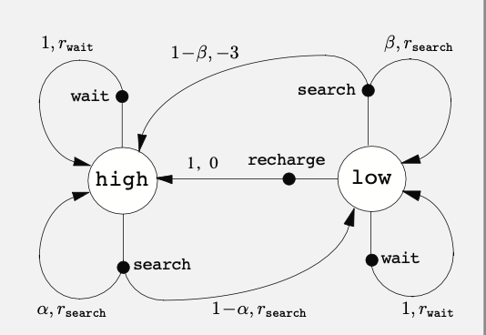

# Chap3:Finite Markov Decision Processes

## Outline:

​          0. BackGround

1. What is FMDP:
   1. What is Markov process?
   2. why is it finite?
   3. What is a Decision Process?
2. Some Notations of quantities in the FMDP:
   1. Prob distribution 
   2. Reward 
   3. State 
   4. Returns and Episodes

## BackGround of FMDP

现在每个人都处于一个巨大的世界（Environment），人们（Agent）需要面对社会以及各种各样的问题，需要做出各种决策（Action），然后接受世界的打压或者奖励（Feed Back），最终走向死亡（有点Depressing ）。

Now,你正在面对一个任务：

你需要连续和三个人轮流进行硬币游戏，你需要选择硬币的一面，当你选择的面与对方一样时你赢，你需要连赢三人，每输一人，就回到前一个人。（对方的硬币其实是提前设定好的，如果也纯随机，这个问题就变的有意思了）

这个问题中，你就像一个Agent，每一轮你需要做出选择（Action）。

当你赢了一轮的时候奖励+1，输了一轮就-1，最终的目标是达到奖励为+3。

整个游戏的状态是：你到了哪一个人面前，比如说你在第二个人面前，那么此时的状态就是2，或者说你在位置2，最终的状态是3.

将这个问题想象成，你与一个环境进行交互，你做出Action，环境给你一个奖励，你观察这个环境，得到当前的状态（你在哪一个人面前），不断循环，最终有一次你走运，连赢了三次，游戏结束。

根据这个游戏，我们可以定义一些常用的量：

1. 时间步骤（time step）：时间点（游戏开始是t =0，你玩了n次就是t = n）
2. 动作（Action）: 在时间点t你选择的动作 $A_t$（每一轮你选择正面还是反面）(一开始的动作是 $A_0$)
3. 奖励（Reward）$R_t$：在做完动作 $A_{t-1}$ 之后，环境给你的奖励（赢了，奖励+1，输了，奖励-1）
4. 状态（State）$S_t$: 在选择动作 $A_{t-1}$之后，你观察环境的情况（你此时在哪一个人面前）

这个游戏的轨迹如下：
$$
A_0 -> (R_1,S_1) -> A_1 ->(R_2,S_2) -> \dots --> (R_T,S_T)
$$

游戏的一开始你选择了一个Action ，然后环境给你奖励以及它的状态，然后你根据这些反馈在做出你这一轮的action，最终你会到达一个最终的状态（Rt = 3，St = 3）

有了这些，我们来看看什么是一个有限马尔可夫决策过程?

## What is the FMDP?

### 1. 什么是Markov 过程？ 

粗略地说，Markov过程是将来的状态只与现在的信息相关，与过去无关。

上面的例子是不是一个Markov过程?

按照这个定义，你将来处于位置2还是位置3，只和你现在哪里有关，比如说你现在在位置1，那么下一轮在位置2的概率是百分之50，你在位置3的概率是0，但是如果你现在在位置2，那么下一轮你在2的概率是百分之50，你在位置3的概率也是百分之50。

所以上面的游戏是一个Markov过程

### 2. Why is it finite? 

我们说一个马尔可夫过程是有限地，表明这个游戏（整个环境）最终会抵达一个最终的状态。

马尔可夫过程的轨迹是：
$$
S_0,A_0,R_1,S_1,A_1,R_2,S_2,A_2,R_3,\dots
$$
如果这个过程是有限的，那么这个轨迹就会在某一个时间t = T停止。

对应的就有一个无限马尔可夫过程，即这个轨迹无休止地进行下去，没有一个最终的状态。

可以举一个无限马尔可夫过程的例子：

> 现在工作室有一个机器人，它的任务是：在这个工作室内收集空的苏打罐子。
>
> 这个机器人上面有传感器来检测哪里有罐子，手臂来拾起罐子，最后将这个罐子放到身上的垃圾桶上。现在特殊的是，这个机器人的电池比较小（不支持它长时间工作，但是是可以更换的）。
>
> 现在考虑机器人有三种动作：1. 原地等待，2.搜索，3.充电，两种状态：低，高
>
> 当机器人电量高的时候，他会做出哪些动作---搜索，等待
>
> 当它电量低时----> 搜索，等待，充电三种
>
> 假设当机器人电量高时，搜索罐子有概率 $\alpha$ 回到电量高的状态（罐子离robot比较近），那么有  $1-\alpha$的概率跌到电量低的状态；当电量低时，搜索罐子有概率 $\beta$维持当前的电量状态，有概率 $1-\beta$ 电量耗尽，需要人来给他更换电池（奖励-3）
>
> 那么对于给robot的奖励而言，当robot完成搜索，并且电池没有耗尽，此时奖励为 $r_{search}$；当robot 原地等待时，获得 $r_{wait}$；当电量低主动recharge时，奖励为0；还有一种惩罚，当它需要人为更换电池时奖励为-3。
>
> 这就是一个典型的无限Markov Process，它的转换图如下：
>
> 
>
> 其中有两种节点，一种是状态节点，一种是动作节点，线上的是对应的概率以及奖励。
>
> 

### 3. What is a Decision Process? 

决策过程是每一轮Agent都需要选择一个Action

那么有一个问题是：是不是所有的任务都可以看成一个决策过程呢？（I don't know currently) 

$$
v_{\pi}(s) = r + \gamma v_{\pi}(s')
$$
